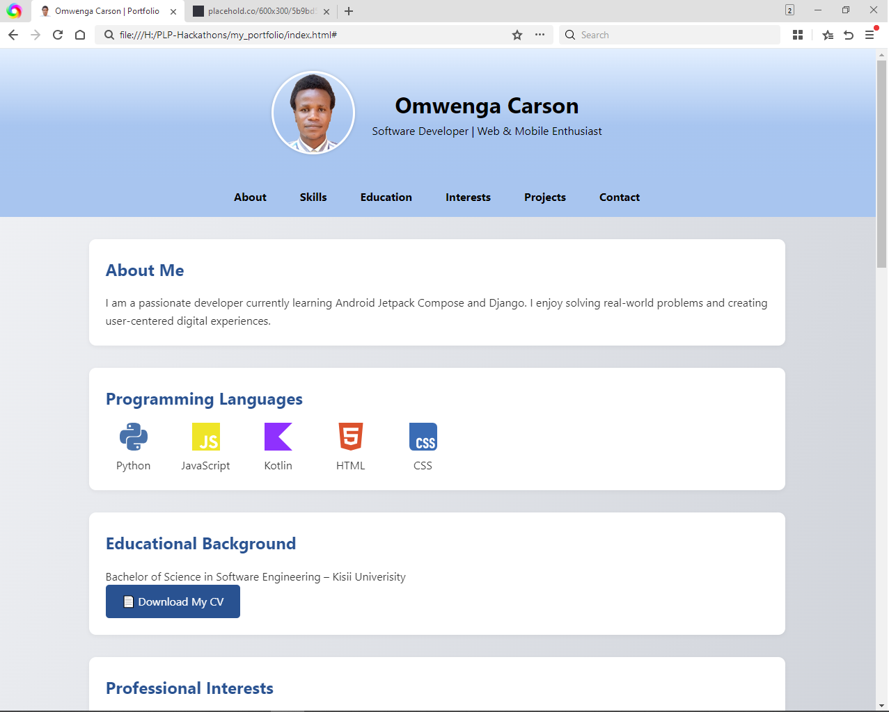

# 🌐 Personal Portfolio Website

This is my responsive personal portfolio website built using **HTML** and **CSS** only. It showcases my background, skills, projects, and contact information.

## 🔍 Features

- Responsive and mobile-friendly layout
- Clean, modern design
- Profile photo and favicon
- Hover effects on cards and skills
- Downloadable CV
- Contact form (non-functional placeholder)
- Skills with tech icons

## 📂 Sections Included

- About Me
- Programming Languages & Tools
- Education
- Professional Interests
- Projects
- Contact Form
- Favicon

## 🛠️ Built With

- HTML5
- CSS3 (Vanilla)
- SimpleIcons and Icons8 for skill icons
- Placehold.co for project images

## 📸 Preview

Other project images include preview images and links. Real screenshots can be added later.

You can preview the website live at (https://omwengaswift.github.io/my_portfolio/)

## 🧑 Author

**Omwenga Carson**  
[GitHub](https://github.com/omwengaswift) • [LinkedIn](omwengacarson) • [Email](omwengaswift@gmail.com)

---

> Feel free to fork and use it as a template for your own portfolio!
